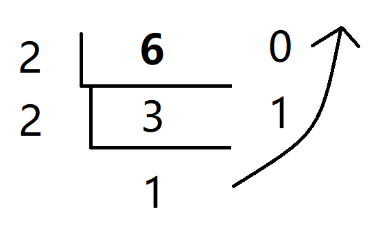
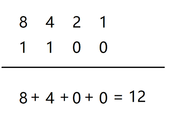

## ONE

****

### 1、计算机进制转换

​	计算机中全部采用二进制表示，只包含0、1两个数，逢二进一，1+1=10，每个0或每个1，叫做1个bit（比特）

- 十进制数**6**转换成二进制数据：使用2获取余数的方式

  

  从下往上，6的二进制数为110

- 二进制数**1100**转成十进制数：使用8421编码的方式

  

​		（把有1位上的数求和，或者上下相乘，0乘任何数为0）相加等于12

#### 字节

​	字节是常见的计算机中最小的存储单元。计算机存储任何数据都是以字节的形式存储。 

​	8个bit（二进制位）0000-0000表示为一个字节，写成**1byte**或者**1B**

- 8个bit = 1B
- 1024B = 1KB
- 1024KB = 1MB
- 1024MB = 1GB
- 1024GB = 1TB
- 1024TB = 1PB
- 1024PB = 1EB

***

### 2、常量

|    类型    |                   含义                   |       数据举例       |
| :--------: | :--------------------------------------: | :------------------: |
|  整数常量  |                所有的整数                |    0，1，567，...    |
|  小数常量  |                所有的小数                | 0.0，-0.1，2.55，... |
|  字符常量  | 单引号引起来，只能写一个字符，必须有内容 |  'a'，'hello'，...   |
| 字符串常量 | 双引号引起来，可以写多个字符，也可也不写 |  "A"，"hello"，...   |
|  布尔常量  |                只有两个值                |      true,false      |
|   空常量   |                只有一个值                |         null         |


****

### 3、数据类型

Java的数据类型分为两大类：

- **基本数据类型：**整数、浮点数、字符、布尔；
- **引用数据类型：**类、数组、接口。

#### 基本数据类型

四类八种基本数据类型：

|   数据类型   |    关键字    | 内存占用 |        取值范围        |
| :----------: | :----------: | :------: | :--------------------: |
|    字节型    |     byte     | 1个字节  |        -128~127        |
|    短整型    |    short     | 2个字节  |      -32768~32767      |
|     整形     |  int(默认)   | 4个字节  |  -231次方~2的3次方-1   |
|    长整型    |     long     | 8个字节  | -2的63次方~2的63次方-1 |
| 单精度浮点数 |    float     | 4个字节  | 1.4013E-45~3.4028E+38  |
| 双精度浮点数 | double(默认) | 8个字节  |  4.9E-324~1.7977E+308  |
|    字符型    |     char     | 2个字节  |        0-65536         |
|   布尔类型   |   boolean    | 1个字节  |       true,false       |

```java
基本数据类型
	整数型 byte、short、int、long
	浮点型 float、double
	字符型 char
	布尔型 boolean
```

​	`Java中的默认类型：整数类型是int、浮点类型是double`

### 4、变量的定义

变量定义的格式包括三个要素：`数据类型`、`变量名`、`数据值`。

**赋值-格式**

```
数据类型 变量名 = 数据值
```

- 变量名称：在同一个大括号范围内，变量的名字不可以相同
- 变量赋值：定义的变量，不赋值不能使用

**创建变量-格式**

```
数据类型 变量名称
```

****

*** 注意：**

​	对于float和long类型来说，字母后缀F和L不要丢掉

例：

```java
float f = 5.5F;
long l = 123456789L
```

