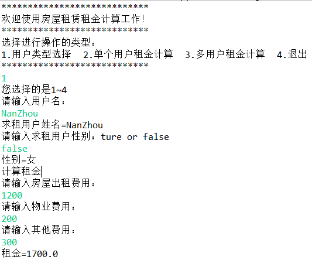

### 房屋租赁管理系统

#### 第一小部分

1. 界面设计（RentCalculateBound.java）

     使用到的知识点：

   - 标识符、关键字

   - 数据类型

   - 常量和变量

   - 数据操作

   - 表达式与语句

   **效果图：**

​	

2. 用户类型选择

   使用到的知识点：

   - 基本程序结构
   - if语句
   - switch语句

​	**效果图**

